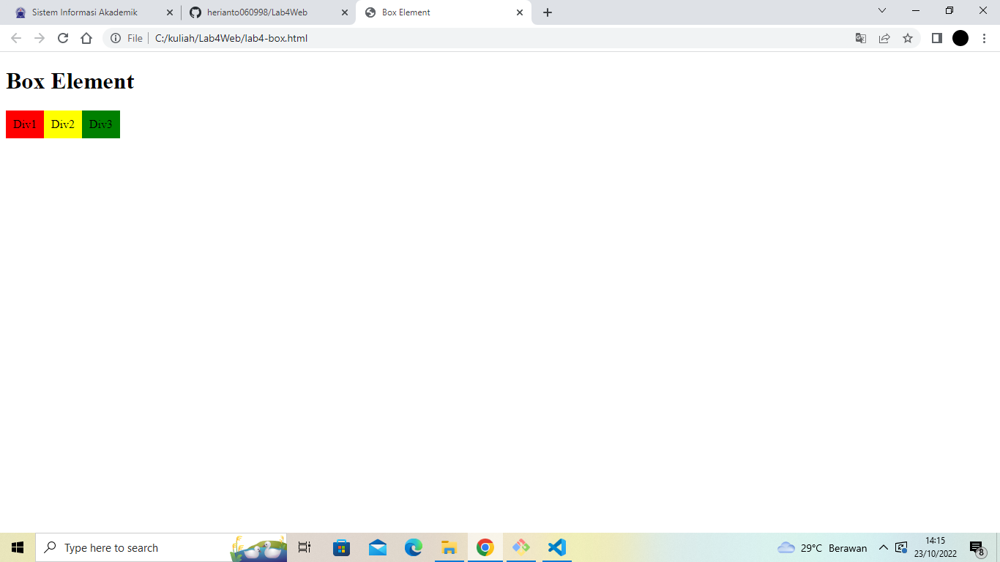
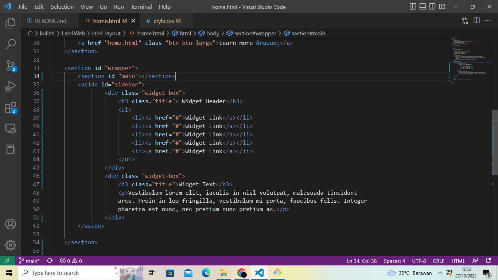
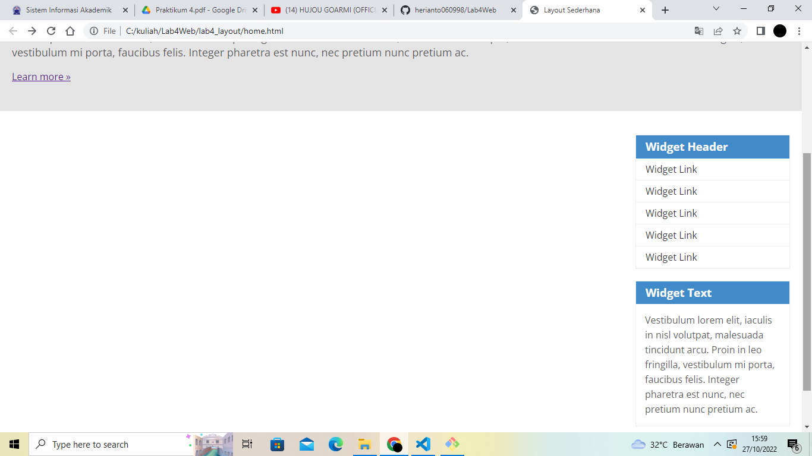
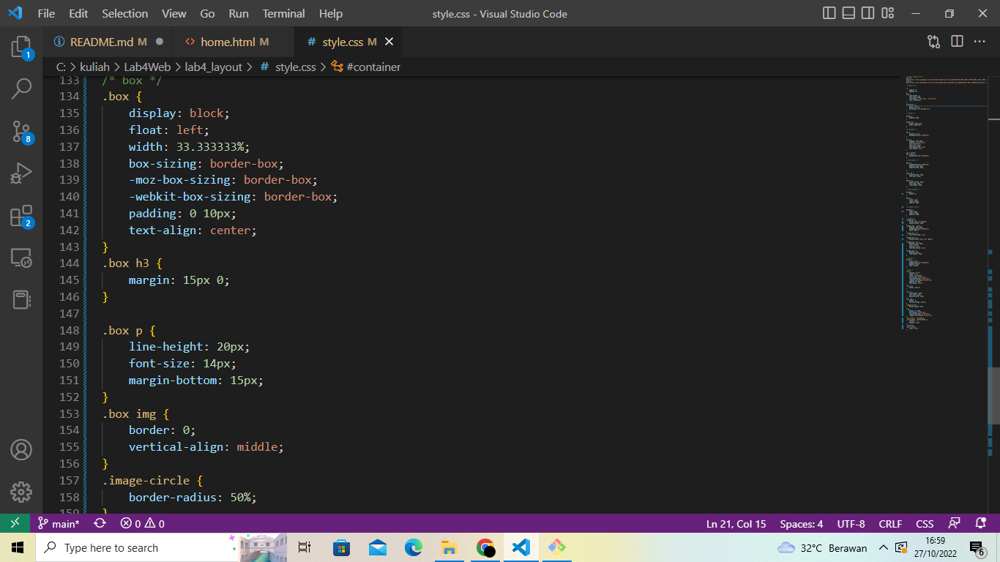

# Lab4Web

# TUGAS 4

| Nama | kelas | Nim | Matkul |
| -- | --- | ---- | ----------- |
| Heri Anto Simamora | TI.21.B.2| 312110365 | Perograman Web |

## MEMBUAT BOX ELEMENT

## CSS FLOAT PROPERTY 

## MENGATUR CLEARFIX ELEMENT

LEFT

RIGHT 

BOTH 

## MEMBUAT LAYOUT SEDERHANA 

## MEMBUAT NAVIGASI 

## MEMBUAT HERO PANEL

## MENGATUR LAYOUT DAN SIDEBAR

## MEMBUAT SIDEBAR WIDGET

# MENGATUR FOOTER

# MENAMBAHKAN ELEMEN LAINNYA PADA MAIN CONTENT

# MENAMBAHKAN KONTEN ARTIKEL 

## TUGAS

1. Tambahkan Layout untuk menu About

=> buat single layout yang berisi deskripsi, portfolio, dll

berikut ini file document HTML dari tugas nomor 1

berikut tampilan menu about

2. Tambahkan layout untuk menu Contact

=> yang berisi form isian: nama, email, message,dll

berikut ini file HTML dari tugas nomor 2

berikut ini tampilan menu kontak

